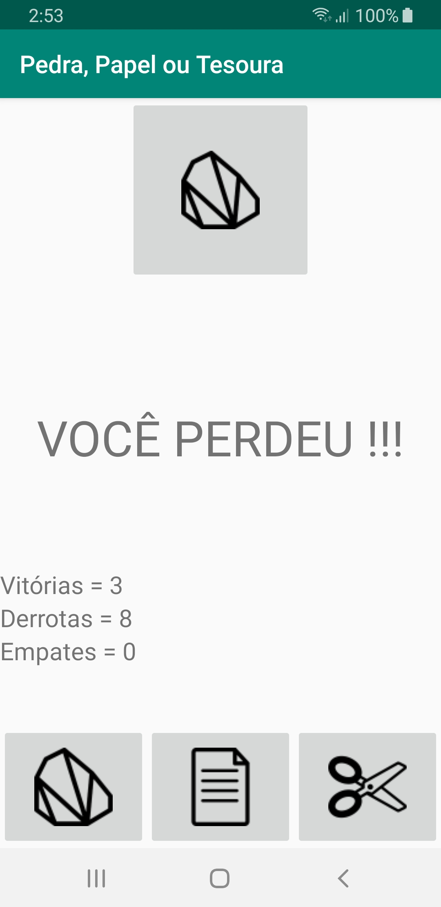
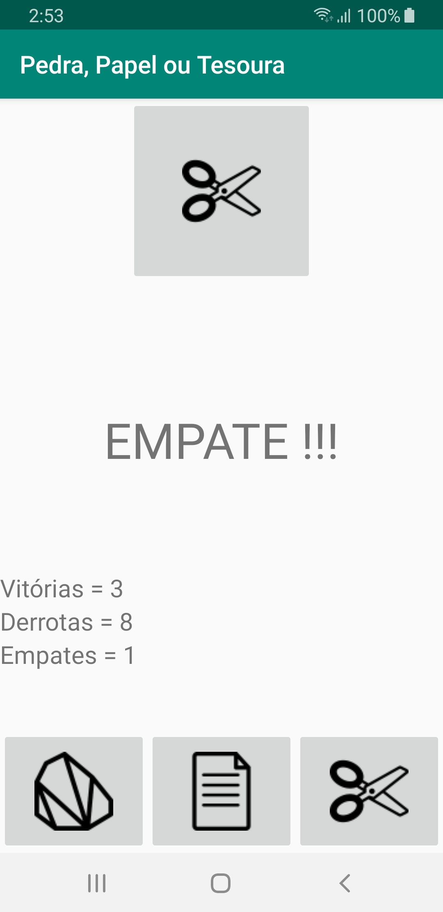

# Exemplo jogo Pedra, Papel ou Tesoura

Um simples jogo de pedra, papel ou tesoura. O programa incrementa um placar que contabiliza o número de vitórias, derrotas e empates.

      

### Licença
Este repositório está disponível sob a licença [Mozilla Public License, version 2.0](https://github.com/jhonatasrm/exemplo-jogo-pedra-papel-tesoura/blob/master/LICENSE)
